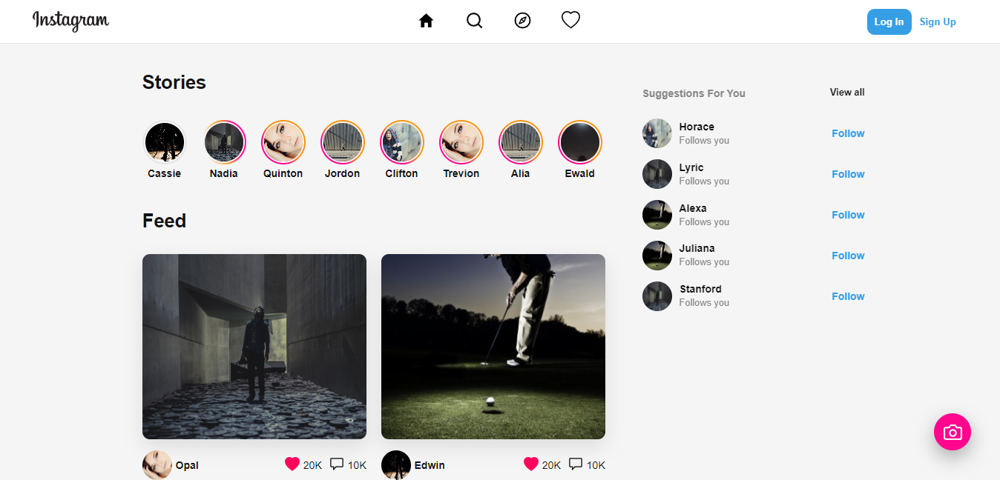

<p align="center">
    
</p>

<h1 align="center">Instagram Clone with a new design of some pages</h1>

<h4 align="center"> 
    <a href="https://instagram-clone-redesign.vercel.app" >DEMO APPLICATION</a> 
</h4>



## Overview

This project is created inspired in Instagram and redesign some screens joining dribbble designs some features using a backend service and other features is working in the client with fake data.

## Features

* Create a post
* Search user profiles
* See stories
* Publish a story
* Set up personal account
* Preview post to comment, save and react

## How to use

To clone and run this application, you'll need Git and NodeJS installed on your computer. From your command line:

```bash
# Clone this repository
$ git clone https://github.com/jhony-24/instagram-clone-redesign.git

# Go into the repository
$ cd instagram-clone-redesign

# Go into the app folder to see the client project
$ cd app

# Install dependencies(You can use npm or yarn)
$ npm install
$ yarn install

# Run the app
$ npm run dev
$ yarn dev
```

## Technologies

* NextJS
* ReactJS
* Strapi
* Styletron
* Zustand
* GraphQL
* MongoDB
* Apollo Client

## Licence

[MIT](https://opensource.org/licenses/MIT)
